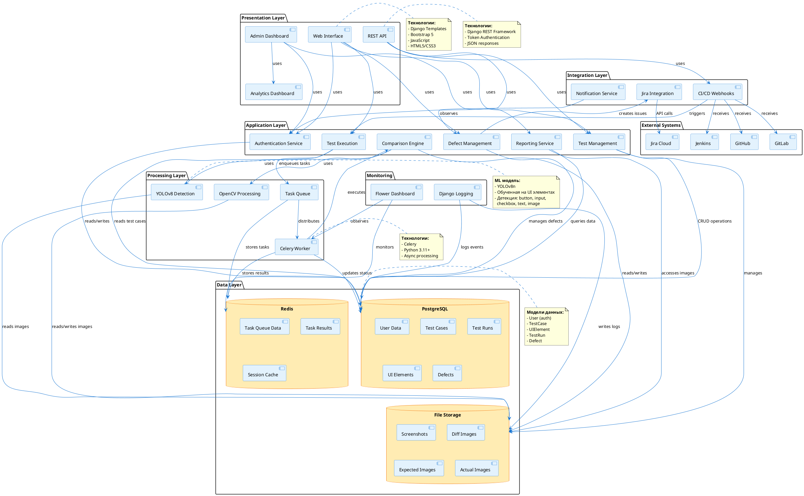

# UML Component Diagram - Система автоматического тестирования UI

## Диаграмма компонентов



---

## Описание компонентов

### 1️⃣ **Presentation Layer (Слой представления)**

#### Web Interface
- **Назначение:** Основной веб-интерфейс для пользователей
- **Технологии:** Django Templates, Bootstrap 5, JavaScript
- **Функции:**
  - Управление тест-кейсами
  - Запуск тестов
  - Просмотр результатов
  - Управление дефектами

#### Admin Dashboard
- **Назначение:** Административная панель
- **Технологии:** Django Admin (кастомизированная)
- **Функции:**
  - Управление пользователями
  - Просмотр аналитики
  - Системные настройки
  - Генерация отчётов

#### REST API
- **Назначение:** Программный интерфейс
- **Технологии:** Django REST Framework
- **Функции:**
  - CRUD операции
  - Webhook endpoints
  - Token authentication
  - JSON responses

#### Analytics Dashboard
- **Назначение:** Визуализация метрик
- **Технологии:** Chart.js, Django Aggregation
- **Функции:**
  - Статистика прогонов
  - Графики дефектов
  - Эффективность тестирования

---

### 2️⃣ **Application Layer (Слой приложения)**

#### Authentication Service
- **Назначение:** Управление аутентификацией и авторизацией
- **Технологии:** Django Authentication Framework
- **Функции:**
  - Регистрация/вход/выход
  - Хеширование паролей (Argon2)
  - Управление сессиями
  - Проверка прав доступа

#### Test Management
- **Назначение:** Управление тест-кейсами
- **Модели:** TestCase, UIElement
- **Функции:**
  - Создание тест-кейсов
  - Определение UI элементов
  - Загрузка эталонных скриншотов
  - Валидация данных

#### Test Execution
- **Назначение:** Запуск тестов
- **Модели:** TestRun
- **Функции:**
  - Создание прогона
  - Постановка задач в очередь
  - Мониторинг выполнения
  - Обработка результатов

#### Comparison Engine
- **Назначение:** Сравнение изображений
- **Технологии:** OpenCV, NumPy, YOLOv8
- **Алгоритмы:**
  - SSIM (Structural Similarity Index)
  - MSE (Mean Squared Error)
  - ORB feature matching
  - Pixel-by-pixel comparison

#### Defect Management
- **Назначение:** Управление дефектами
- **Модели:** Defect
- **Функции:**
  - Создание дефектов
  - Интеграция с Jira
  - Отслеживание статуса
  - Категоризация

#### Reporting Service
- **Назначение:** Генерация отчётов
- **Технологии:** Django ORM, Aggregation
- **Функции:**
  - Сводные отчёты
  - Экспорт данных
  - Визуализация

---

### 3️⃣ **Integration Layer (Слой интеграций)**

#### CI/CD Webhooks
- **Назначение:** Интеграция с CI/CD системами
- **Поддерживаемые платформы:**
  - GitHub (HMAC-SHA256)
  - GitLab (Secret Token)
  - Jenkins (Bearer Token)
- **Функции:**
  - Приём webhook событий
  - Валидация подписей
  - Автоматический запуск тестов

#### Jira Integration
- **Назначение:** Интеграция с Jira
- **Технологии:** Jira REST API v3
- **Функции:**
  - Создание issues
  - Прикрепление скриншотов
  - Обновление статуса
  - API Token authentication

#### Notification Service
- **Назначение:** Уведомления
- **Каналы:**
  - Email (Django email)
  - Webhook callbacks
- **События:**
  - Завершение теста
  - Обнаружение дефектов
  - Ошибки выполнения

---

### 4️⃣ **Processing Layer (Слой обработки)**

#### Celery Worker
- **Назначение:** Фоновая обработка задач
- **Технологии:** Celery 5.3+, Python
- **Задачи:**
  - `run_ui_comparison_task`
  - `detect_ui_elements_task`
  - Асинхронное выполнение

#### Task Queue
- **Назначение:** Очередь задач
- **Технологии:** Redis (broker)
- **Функции:**
  - Постановка задач
  - Распределение по воркерам
  - Хранение результатов

#### YOLOv8 Detection
- **Назначение:** ML-детекция UI элементов
- **Модель:** YOLOv8n (nano)
- **Классы:**
  - button
  - input
  - checkbox
  - text
  - image
- **Точность:** 0.25+ confidence

#### OpenCV Processing
- **Назначение:** Обработка изображений
- **Библиотеки:** OpenCV, NumPy
- **Операции:**
  - Выравнивание (alignment)
  - Вычисление SSIM
  - Генерация diff карты
  - Feature extraction (ORB)

---

### 5️⃣ **Data Layer (Слой данных)**

#### PostgreSQL Database
- **Назначение:** Основное хранилище данных
- **Версия:** PostgreSQL 15+
- **Схема:**
  - `auth_user` - пользователи
  - `testsystem_testcase` - тест-кейсы
  - `testsystem_uielement` - UI элементы
  - `testsystem_testrun` - прогоны
  - `testsystem_defect` - дефекты
- **Особенности:**
  - Foreign Keys с CASCADE
  - Indexes на часто запрашиваемые поля
  - Connection pooling

#### Redis Cache
- **Назначение:** Кеш и очередь сообщений
- **Версия:** Redis 7+
- **Использование:**
  - Celery broker (db 0)
  - Celery results (db 0)
  - Session cache (опционально)
- **Настройки:**
  - Persistence: AOF
  - Eviction policy: allkeys-lru

#### File Storage
- **Назначение:** Хранилище файлов
- **Путь:** `autotest_ui/media/`
- **Структура:**
  ```
  media/
  ├── screenshots/          # Эталонные скриншоты UI элементов
  ├── expected_screenshots/ # Ожидаемые результаты
  ├── actual_screenshots/   # Фактические результаты
  └── diff_images/         # Изображения различий
  ```
- **Особенности:**
  - Автоматическое удаление при CASCADE
  - Валидация форматов (PNG, JPG)
  - Организация по тест-кейсам

---

### 6️⃣ **External Systems (Внешние системы)**

#### GitHub
- **Тип интеграции:** Webhooks
- **События:** `push`, `pull_request`
- **Аутентификация:** HMAC-SHA256

#### GitLab
- **Тип интеграции:** Webhooks
- **События:** `Push Hook`, `Merge Request Hook`
- **Аутентификация:** Secret Token

#### Jenkins
- **Тип интеграции:** Webhooks
- **События:** Build completion
- **Аутентификация:** Bearer Token

#### Jira Cloud
- **Тип интеграции:** REST API v3
- **Операции:** Create Issue, Upload Attachment
- **Аутентификация:** API Token (Basic Auth)

---

### 7️⃣ **Monitoring (Мониторинг)**

#### Flower Dashboard
- **Назначение:** Мониторинг Celery
- **URL:** `http://localhost:5555`
- **Функции:**
  - Активные задачи
  - История выполнения
  - Статистика воркеров
  - Traceback ошибок
- **Безопасность:** Basic Auth

#### Django Logging
- **Назначение:** Логирование событий
- **Уровни:** DEBUG, INFO, WARNING, ERROR, CRITICAL
- **Файлы:**
  - `logs/security.log` - события безопасности
  - `logs/application.log` - общие события
- **Формат:** Timestamp, Level, Module, Message

---

## Взаимодействие компонентов

### Сценарий 1: Запуск теста вручную

```
Пользователь (WebUI)
  ↓
1. Выбирает тест-кейс → Test Management
  ↓
2. Нажимает "Run Test" → Test Execution
  ↓
3. Создаёт TestRun → PostgreSQL
  ↓
4. Ставит задачу в очередь → Task Queue (Redis)
  ↓
5. Celery Worker забирает задачу
  ↓
6. Загружает скриншоты → File Storage
  ↓
7. Детектирует элементы → YOLOv8
  ↓
8. Сравнивает изображения → Comparison Engine (OpenCV)
  ↓
9. Сохраняет результаты → PostgreSQL + File Storage
  ↓
10. Если дефект → Defect Management → Jira Cloud
  ↓
11. Пользователь видит результат → WebUI
```

### Сценарий 2: Автоматический запуск через CI/CD

```
GitHub/GitLab/Jenkins
  ↓
1. Push в репозиторий → отправка webhook
  ↓
2. Webhook получен → CI/CD Webhooks
  ↓
3. Валидация подписи (HMAC/Token)
  ↓
4. Триггер запуска → Test Execution
  ↓
5. ... (как в Сценарии 1, шаги 3-10)
  ↓
6. Callback в CI/CD (опционально)
```

---

## Протоколы и интерфейсы

### HTTP/HTTPS
- **Presentation Layer ↔ Application Layer**
- **Application Layer ↔ External Systems**
- Методы: GET, POST, PUT, DELETE
- Форматы: JSON, HTML, Form Data

### PostgreSQL Protocol
- **Application Layer ↔ PostgreSQL**
- Порт: 5432
- Connection pooling: 600s timeout

### Redis Protocol (RESP)
- **Processing Layer ↔ Redis**
- Порт: 6379
- Databases: 0 (tasks), 1 (cache)

### File System
- **Application/Processing Layer ↔ File Storage**
- Протокол: OS file operations
- Формат: Binary (images)

---

## Развёртывание компонентов

### Development
```
Порт 8000:  Django Web Server
Порт 5432:  PostgreSQL
Порт 6379:  Redis (Docker)
Порт 5555:  Flower
Без порта:  Celery Worker (CLI)
```

### Production (Docker Compose)
```yaml
services:
  web:       Django + Gunicorn
  postgres:  PostgreSQL
  redis:     Redis
  celery:    Celery Worker
  flower:    Flower Dashboard
  nginx:     Reverse Proxy (80/443)
```

---

## Зависимости компонентов

```
Web Interface
  ├── Authentication Service
  ├── Test Management
  ├── Test Execution
  └── Defect Management

Test Execution
  ├── Task Queue
  └── PostgreSQL

Celery Worker
  ├── Redis (broker)
  ├── Comparison Engine
  │   ├── YOLOv8
  │   └── OpenCV
  ├── File Storage
  └── PostgreSQL

Defect Management
  ├── Jira Integration
  └── PostgreSQL
```

---

## Масштабирование

### Горизонтальное масштабирование

**Celery Workers:**
- Запуск нескольких экземпляров
- Автоматическое распределение задач через Redis
- Рекомендация: 1 воркер на 2 CPU cores

**Django Web Servers:**
- Gunicorn с несколькими workers
- Nginx как load balancer
- Рекомендация: workers = (2 × CPU) + 1

### Вертикальное масштабирование

**PostgreSQL:**
- Увеличение RAM для кеша
- SSD для storage
- Индексы на часто запрашиваемые поля

**Redis:**
- Увеличение maxmemory
- Persistence: RDB + AOF

---

## Технологический стек

| Компонент | Технология | Версия |
|-----------|-----------|--------|
| **Backend** | Django | 5.2+ |
| **API** | Django REST Framework | 3.15+ |
| **Database** | PostgreSQL | 15+ |
| **Cache/Queue** | Redis | 7+ |
| **Task Queue** | Celery | 5.3+ |
| **ML Detection** | YOLOv8 | ultralytics |
| **Image Processing** | OpenCV | 4.8+ |
| **Frontend** | Bootstrap | 5.3 |
| **Monitoring** | Flower | 2.0+ |
| **Web Server** | Gunicorn | 21+ |
| **Reverse Proxy** | Nginx | 1.24+ |

---

## Как построить диаграмму

### Онлайн инструменты:

1. **PlantUML Online Server**
   - URL: http://www.plantuml.com/plantuml/uml/
   - Скопируйте код из блока ```plantuml
   - Вставьте и получите PNG/SVG

2. **PlantText**
   - URL: https://www.planttext.com/
   - Удобный редактор с предпросмотром

3. **Kroki**
   - URL: https://kroki.io/
   - Поддержка множества форматов

### Локальная установка:

```bash
# Ubuntu/Debian
sudo apt-get install plantuml

# macOS
brew install plantuml

# Генерация диаграммы
plantuml UML_COMPONENT_DIAGRAM.md
```

### VS Code Extension:

```
Название: PlantUML
Издатель: jebbs
Установка: Extensions → Поиск "PlantUML" → Install
Использование: Alt+D для preview
```

---

**Дата создания:** 05.12.2025  
**Версия:** 1.0  
**Автор:** Система автоматического тестирования UI
