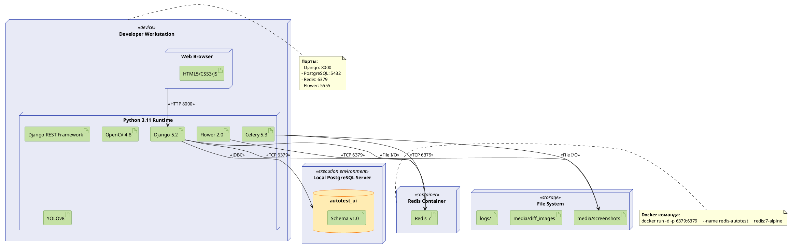
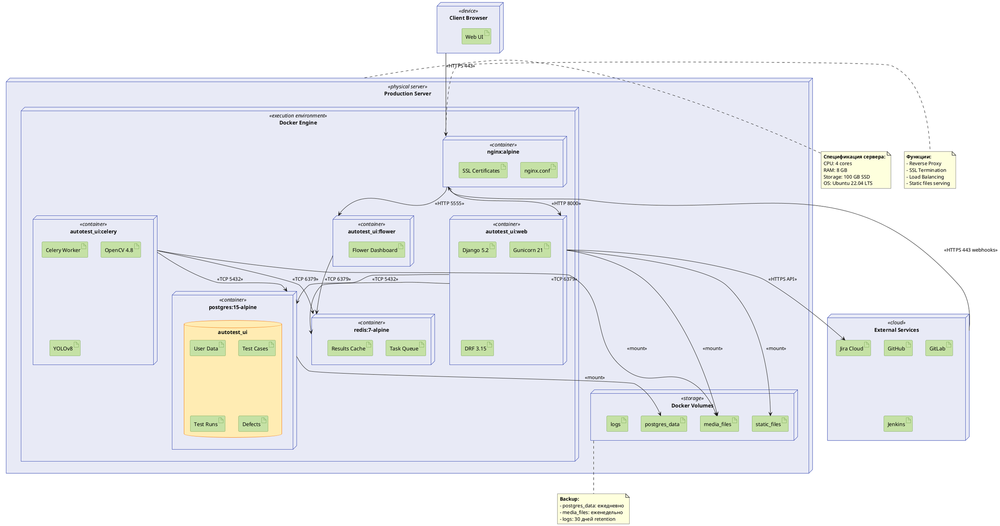
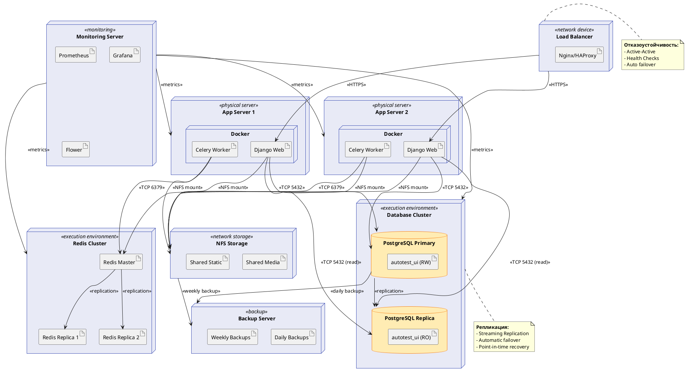

# UML Deployment Diagram - Система автоматического тестирования UI

## Диаграмма развертывания

### Вариант 1: Development Environment (Разработка)



---

### Вариант 2: Production Environment (Docker Compose)



---

### Вариант 3: High Availability (HA) Production



---

## Описание конфигураций

### 1. Development Environment (Разработка)

#### Характеристики:
- **Цель:** Локальная разработка и тестирование
- **Окружение:** Одна машина разработчика
- **Сложность:** Низкая
- **Стоимость:** Минимальная

#### Компоненты:

**Developer Workstation:**
- **OS:** Windows 10/11, macOS, или Linux
- **RAM:** Минимум 8 GB (рекомендуется 16 GB)
- **CPU:** 4+ cores
- **Storage:** 20 GB свободного места

**Python Runtime:**
- Python 3.11+
- Virtual Environment (venv)
- Все зависимости из `requirements.txt`

**PostgreSQL:**
- Версия: 15+
- Порт: 5432
- База: `autotest_ui`
- Установка: Локальная или Docker

**Redis:**
- Версия: 7+
- Порт: 6379
- Установка: Docker (рекомендуется)
- Команда: `docker run -d -p 6379:6379 redis:7-alpine`

**File Storage:**
- Путь: `autotest_ui/media/`
- Структура:
  ```
  media/
  ├── screenshots/
  ├── expected_screenshots/
  ├── actual_screenshots/
  └── diff_images/
  ```

#### Запуск:

```bash
# Терминал 1: Django
cd autotest_ui
python manage.py runserver

# Терминал 2: Redis (Docker)
docker run -d -p 6379:6379 --name redis-autotest redis:7-alpine

# Терминал 3: Celery Worker
cd autotest_ui
celery -A autotest_ui worker -l info --pool=solo

# Терминал 4: Flower (опционально)
cd autotest_ui
celery -A autotest_ui flower --port=5555
```

#### Порты:
- `8000` - Django Web Server
- `5432` - PostgreSQL
- `6379` - Redis
- `5555` - Flower Dashboard

---

### 2. Production Environment (Docker Compose)

#### Характеристики:
- **Цель:** Production развертывание
- **Окружение:** Один физический сервер
- **Сложность:** Средняя
- **Масштабирование:** Вертикальное

#### Спецификация сервера:

**Минимальные требования:**
- **CPU:** 4 cores (рекомендуется 8)
- **RAM:** 8 GB (рекомендуется 16 GB)
- **Storage:** 100 GB SSD
- **OS:** Ubuntu 22.04 LTS
- **Network:** 1 Gbps

**Распределение ресурсов:**
```yaml
services:
  web:
    cpus: '2.0'
    memory: 2G
  
  celery:
    cpus: '2.0'
    memory: 3G
  
  postgres:
    cpus: '1.0'
    memory: 2G
  
  redis:
    cpus: '0.5'
    memory: 512M
```

#### Компоненты:

**Nginx Container:**
- **Образ:** `nginx:alpine`
- **Функции:**
  - Reverse Proxy
  - SSL Termination (Let's Encrypt)
  - Static files serving
  - Gzip compression
- **Порты:** 80 (HTTP), 443 (HTTPS)
- **Конфигурация:** `/etc/nginx/conf.d/autotest.conf`

**Django Web Container:**
- **Образ:** Custom (Dockerfile)
- **Base:** `python:3.11-slim`
- **WSGI Server:** Gunicorn
  - Workers: `(2 × CPU cores) + 1 = 9`
  - Threads: 2 per worker
  - Timeout: 120s
- **Порт:** 8000 (internal)

**Celery Worker Container:**
- **Образ:** Custom (same as Django)
- **Concurrency:** 4 workers
- **Task types:**
  - `run_ui_comparison_task`
  - `detect_ui_elements_task`
- **Особенности:**
  - Shared media volume
  - Access to PostgreSQL and Redis

**Flower Container:**
- **Образ:** Custom (Flask-based)
- **Порт:** 5555 (internal)
- **Доступ:** Через Nginx `/flower/` path
- **Аутентификация:** Basic Auth

**PostgreSQL Container:**
- **Образ:** `postgres:15-alpine`
- **Volume:** `postgres_data` (persistent)
- **Параметры:**
  - `shared_buffers`: 2GB
  - `work_mem`: 64MB
  - `maintenance_work_mem`: 512MB
  - `max_connections`: 200
- **Backup:** Автоматический ежедневно в 2:00 AM

**Redis Container:**
- **Образ:** `redis:7-alpine`
- **Persistence:** AOF + RDB
- **Eviction policy:** `allkeys-lru`
- **Maxmemory:** 512MB

#### Docker Volumes:

```yaml
volumes:
  postgres_data:
    driver: local
  
  media_files:
    driver: local
  
  static_files:
    driver: local
  
  logs:
    driver: local
```

#### Сетевая конфигурация:

```yaml
networks:
  frontend:
    driver: bridge
    ipam:
      config:
        - subnet: 172.20.0.0/24
  
  backend:
    driver: bridge
    internal: true
    ipam:
      config:
        - subnet: 172.21.0.0/24
```

#### Безопасность:

**SSL/TLS:**
- Сертификаты: Let's Encrypt (автообновление)
- TLS версии: 1.2, 1.3
- Cipher suites: Strong only
- HSTS: enabled (1 год)

**Firewall:**
```bash
# UFW правила
sudo ufw allow 22/tcp    # SSH
sudo ufw allow 80/tcp    # HTTP
sudo ufw allow 443/tcp   # HTTPS
sudo ufw enable
```

**Docker secrets:**
```yaml
secrets:
  db_password:
    file: ./secrets/db_password.txt
  
  django_secret_key:
    file: ./secrets/django_secret.txt
  
  jira_api_token:
    file: ./secrets/jira_token.txt
```

#### Мониторинг:

**Health Checks:**
```yaml
healthcheck:
  test: ["CMD", "curl", "-f", "http://localhost:8000/health/"]
  interval: 30s
  timeout: 10s
  retries: 3
  start_period: 40s
```

**Логирование:**
```yaml
logging:
  driver: "json-file"
  options:
    max-size: "10m"
    max-file: "3"
```

#### Backup стратегия:

**PostgreSQL:**
```bash
#!/bin/bash
# backup.sh
docker exec postgres pg_dump -U postgres autotest_ui | \
  gzip > /backups/db_$(date +%Y%m%d_%H%M%S).sql.gz

# Retention: 30 дней
find /backups -name "db_*.sql.gz" -mtime +30 -delete
```

**Media files:**
```bash
#!/bin/bash
# backup_media.sh
tar -czf /backups/media_$(date +%Y%m%d).tar.gz \
  /var/lib/docker/volumes/media_files/_data

# Retention: 14 дней
find /backups -name "media_*.tar.gz" -mtime +14 -delete
```

**Cron задачи:**
```cron
# Backup БД ежедневно в 2:00
0 2 * * * /opt/scripts/backup.sh

# Backup media еженедельно по воскресеньям в 3:00
0 3 * * 0 /opt/scripts/backup_media.sh
```

---

### 3. High Availability (HA) Production

#### Характеристики:
- **Цель:** Высокая доступность и отказоустойчивость
- **Окружение:** Кластер серверов
- **Сложность:** Высокая
- **Масштабирование:** Горизонтальное + Вертикальное
- **SLA:** 99.9% uptime

#### Архитектурные компоненты:

**Load Balancer:**
- **Решение:** Nginx или HAProxy
- **Режим:** Active-Active
- **Алгоритм:** Round Robin с Health Checks
- **Sticky sessions:** Включены (cookie-based)
- **SSL offloading:** Да

**Application Servers (2+):**
- **Конфигурация:** Идентичные
- **Auto-scaling:** Горизонтальное по CPU > 70%
- **Health checks:** HTTP /health/ каждые 10s
- **Deployment:** Blue-Green или Rolling

**Database Cluster:**

**PostgreSQL Primary (Master):**
- Операции: Read + Write
- Synchronous commit: on
- WAL archiving: enabled
- Auto-failover: pgpool-II или Patroni

**PostgreSQL Replica (Slave):**
- Операции: Read-only
- Streaming replication: async
- Lag monitoring: < 1s
- Promotion: автоматическая при сбое Primary

**Replication:**
```
Primary (RW)
   ├─→ Replica 1 (RO) - async
   └─→ Replica 2 (RO) - async
```

**Redis Cluster:**

**Redis Master:**
- Операции: Read + Write
- Persistence: AOF
- Replication: async

**Redis Replicas (2):**
- Операции: Read-only
- Auto-failover: Redis Sentinel
- Promotion: автоматическая

**Cluster топология:**
```
Master (RW)
   ├─→ Replica 1 (RO)
   └─→ Replica 2 (RO)

Sentinel 1, 2, 3 (мониторинг + failover)
```

#### Shared Storage:

**NFS Server:**
- **Назначение:** Shared media и static files
- **Протокол:** NFSv4
- **Mount options:** `rw,sync,hard,intr`
- **Backup:** Incremental daily

**Альтернативы:**
- Object Storage (S3, MinIO)
- GlusterFS
- Ceph

#### Мониторинг и Alerting:

**Prometheus:**
- Metrics collection: каждые 15s
- Retention: 30 дней
- Targets:
  - Node Exporter (OS metrics)
  - PostgreSQL Exporter
  - Redis Exporter
  - Django metrics (django-prometheus)

**Grafana:**
- Dashboards:
  - Infrastructure Overview
  - Application Performance
  - Database Metrics
  - Celery Tasks
- Alerting: Email, Slack

**Flower:**
- Celery tasks monitoring
- Worker health
- Task execution time

**Alerts:**
- CPU > 80% (warning), > 90% (critical)
- RAM > 85% (warning), > 95% (critical)
- Disk > 80% (warning)
- PostgreSQL replication lag > 5s
- HTTP 5xx errors > 10/min
- Celery tasks failing > 5/min

#### Backup стратегия:

**PostgreSQL:**
- **Full backup:** Ежедневно (pg_basebackup)
- **WAL archiving:** Непрерывно
- **Point-in-time recovery:** Возможен откат на любой момент времени
- **Retention:** 30 дней full, 90 дней WAL
- **Storage:** Offsite (S3 или другой датацентр)

**Media Files:**
- **Incremental backup:** Ежедневно (rsync)
- **Full backup:** Еженедельно
- **Retention:** 14 дней

**Тестирование восстановления:**
- Частота: Ежемесячно
- Метрика: RTO (Recovery Time Objective) < 1 час
- Метрика: RPO (Recovery Point Objective) < 15 минут

#### Disaster Recovery:

**Сценарии:**

1. **Отказ одного App Server:**
   - Load Balancer автоматически исключает из пула
   - RTO: 0 (instant failover)
   - Действия: Диагностика и восстановление сервера

2. **Отказ PostgreSQL Primary:**
   - Автоматический failover на Replica (Patroni)
   - RTO: < 30 секунд
   - Действия: Анализ причины, восстановление Primary как Replica

3. **Отказ Redis Master:**
   - Redis Sentinel промоутит одну из Replica
   - RTO: < 10 секунд
   - Действия: Восстановление бывшего Master как Replica

4. **Полный отказ датацентра:**
   - Переключение DNS на резервный датацентр
   - Восстановление из backups
   - RTO: < 4 часа
   - RPO: < 15 минут (последний WAL архив)

---

## Сравнение конфигураций

| Параметр | Development | Production (Single) | Production (HA) |
|----------|-------------|---------------------|------------------|
| **Серверов** | 1 (workstation) | 1 | 5+ |
| **CPU cores** | 4 | 8 | 32+ (суммарно) |
| **RAM** | 8 GB | 16 GB | 64+ GB (суммарно) |
| **Storage** | 20 GB | 100 GB SSD | 500+ GB SSD |
| **Uptime SLA** | N/A | 99% | 99.9%+ |
| **RTO** | N/A | 1-2 часа | < 30 сек |
| **Стоимость/мес** | $0 | ~$50-100 | ~$500-1000 |
| **Сложность** | Низкая | Средняя | Высокая |
| **Масштабирование** | - | Вертикальное | Горизонтальное |
| **Backup** | Ручной | Автоматический | Автоматический + Offsite |
| **Мониторинг** | Логи | Flower + Logs | Prometheus + Grafana |
| **Load Balancing** | - | - | Да (Nginx/HAProxy) |
| **DB Replication** | - | - | Да (streaming) |
| **Redis HA** | - | - | Да (Sentinel) |
| **Shared Storage** | Local FS | Docker Volumes | NFS/S3 |

---

## Сетевая диаграмма (Production)

```
Internet
   │
   ▼
[Firewall]
   │
   ▼
[Load Balancer] :80, :443
   │
   ├──────────────┬──────────────┐
   ▼              ▼              ▼
[App1]        [App2]        [App3]
:8000         :8000         :8000
   │              │              │
   └──────┬───────┴──────┬───────┘
          │              │
          ▼              ▼
   [PostgreSQL]    [Redis Cluster]
     Primary        Master + 2 Replicas
     + Replica      :6379
     :5432
          │
          ▼
   [NFS Storage]
   /media, /static
```

---

## Технологический стек по окружениям

### Development
```yaml
OS: Windows/macOS/Linux
Python: 3.11+
Django: 5.2+
PostgreSQL: 15+ (local or Docker)
Redis: 7 (Docker)
Web Server: Django runserver
Task Queue: Celery (--pool=solo)
```

### Production (Single Server)
```yaml
OS: Ubuntu 22.04 LTS
Containerization: Docker + Docker Compose
Web Server: Nginx + Gunicorn
Application: Django 5.2 in container
Database: PostgreSQL 15 in container
Cache/Queue: Redis 7 in container
Task Workers: Celery in container
Monitoring: Flower
SSL: Let's Encrypt
```

### Production (HA)
```yaml
OS: Ubuntu 22.04 LTS (on all nodes)
Orchestration: Docker Swarm or Kubernetes
Load Balancer: Nginx/HAProxy (active-active)
Application: Django (2+ instances)
Database: PostgreSQL Cluster (Patroni/pgpool-II)
Cache/Queue: Redis Cluster (Sentinel)
Storage: NFS or Object Storage (S3/MinIO)
Monitoring: Prometheus + Grafana
Logging: ELK Stack (Elasticsearch, Logstash, Kibana)
Alerting: Alertmanager → Slack/Email
```

---

## Развёртывание

### Development (Quick Start)

```bash
# 1. Clone repository
git clone https://github.com/AlexTDE/curse_Work.git
cd curse_Work/autotest_ui

# 2. Create virtual environment
python -m venv venv
source venv/bin/activate  # Linux/macOS
# venv\Scripts\activate   # Windows

# 3. Install dependencies
pip install -r requirements.txt

# 4. Setup database
python manage.py migrate
python manage.py createsuperuser

# 5. Run Redis (Docker)
docker run -d -p 6379:6379 --name redis-autotest redis:7-alpine

# 6. Run Django
python manage.py runserver

# 7. Run Celery (new terminal)
celery -A autotest_ui worker -l info --pool=solo
```

### Production (Docker Compose)

```bash
# 1. Clone repository
git clone https://github.com/AlexTDE/curse_Work.git
cd curse_Work

# 2. Configure environment
cp .env.example .env
vim .env  # Edit configuration

# 3. Build and start
docker-compose up -d --build

# 4. Run migrations
docker-compose exec web python manage.py migrate

# 5. Create superuser
docker-compose exec web python manage.py createsuperuser

# 6. Collect static files
docker-compose exec web python manage.py collectstatic --noinput
```

### Production (HA) - Kubernetes

```bash
# 1. Apply configurations
kubectl apply -f k8s/namespace.yaml
kubectl apply -f k8s/secrets.yaml
kubectl apply -f k8s/configmaps.yaml

# 2. Deploy database
kubectl apply -f k8s/postgres-statefulset.yaml
kubectl apply -f k8s/postgres-service.yaml

# 3. Deploy Redis
kubectl apply -f k8s/redis-statefulset.yaml
kubectl apply -f k8s/redis-service.yaml

# 4. Deploy application
kubectl apply -f k8s/django-deployment.yaml
kubectl apply -f k8s/django-service.yaml

# 5. Deploy Celery workers
kubectl apply -f k8s/celery-deployment.yaml

# 6. Deploy Ingress
kubectl apply -f k8s/ingress.yaml
```

---

## Рекомендации по выбору конфигурации

### Используйте Development если:
- Разрабатываете и тестируете локально
- Изучаете систему
- Демонстрируете функционал (курсовая работа)
- Бюджет: $0

### Используйте Production (Single Server) если:
- Небольшая команда (< 20 пользователей)
- Ограниченный бюджет
- Нагрузка < 100 req/sec
- Допустим downtime для обновлений
- Бюджет: ~$50-100/мес

### Используйте Production (HA) если:
- Критичная система (production)
- Много пользователей (100+)
- Высокая нагрузка (> 100 req/sec)
- Требуется SLA 99.9%+
- Zero-downtime deployments
- Бюджет: ~$500-1000/мес

---

## Дополнительные материалы

### Dockerfile (пример)

```dockerfile
FROM python:3.11-slim

WORKDIR /app

# Install system dependencies
RUN apt-get update && apt-get install -y \
    postgresql-client \
    libpq-dev \
    gcc \
    && rm -rf /var/lib/apt/lists/*

# Install Python dependencies
COPY requirements.txt .
RUN pip install --no-cache-dir -r requirements.txt

# Copy application
COPY . .

# Collect static files
RUN python manage.py collectstatic --noinput

EXPOSE 8000

CMD ["gunicorn", "autotest_ui.wsgi:application", \
     "--bind", "0.0.0.0:8000", \
     "--workers", "4", \
     "--timeout", "120"]
```

### docker-compose.yml (пример)

Смотрите в репозитории: `docker-compose.yml`

---

**Дата создания:** 05.12.2025  
**Версия:** 1.0  
**Автор:** Система автоматического тестирования UI
